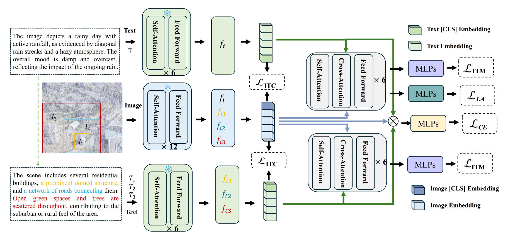

# WeatherPrompt


**WeatherPrompt** is a **training-free, all-weather, text-guided cross-view localization framework**. The core idea is to introduce **open-ended weather descriptions** into the retrieval process to counteract the observational shifts and cross-view misalignments caused by rain, fog, snow, and night conditions.

We introduce a **training-free multi-weather prompting pipeline**: leveraging University-1652 and SUES-200, we synthesize adverse-weather views and use a **two-stage prompt (“weather-first, then spatial”)** to express **coarse-to-fine semantics**, thereby **auto-generating high-quality open-set image–text pairs** for alignment and supervision.

Extensive experiments validate the effectiveness of WeatherPrompt. On University-1652, Drone $\rightarrow$ Satellite achieves R@1 77.14\% / AP 80.20\% and Satellite $\rightarrow$ Drone achieves R@1 87.72\% / AP 76.39\%. Compared with representative methods, Drone $\rightarrow$ Satellite improves R@1 by 11.99\% and AP by 11.04\%, while Satellite $\rightarrow$ Drone improves R@1 by 3.04\% and AP by 10.64\%. On SUES-200, Satellite $\rightarrow$ Drone reaches R@1 80.73\% / AP 66.12\%, showing consistent advantages. Under real-world Dark+Rain+Fog videos, Drone $\rightarrow$ Satellite attains AP 64.94\% and Satellite $\rightarrow$ Drone AP 72.15\%, evidencing strong generalization and robustness in adverse weather. More details can be found at our paper: [WeatherPrompt: Multi-modality Representation Learning for All-Weather Drone Visual Geo-Localization](https://arxiv.org/pdf/2508.09560)
<div align="center"></div>

## News
* The **CoT Prompt** is released, Welcome to communicate！
* The **Models** and **Weights** are released, Welcome to communicate！
* We provide some of the tools in the **Weather.py**.


## CoT Prompt
* The **prompt** format:
```
You are an expert aerial image analyst. Given a single aerial image, think step by step and then produce exactly two sentences in English.

Follow this reasoning process internally, but DO NOT show the steps in your answer:

1. Global weather impression: Observe the sky, lighting, color tone, and overall contrast to infer the general atmosphere (clear, overcast, foggy, rainy, snowy, nighttime, etc.).
2. Weather evidence: Look carefully for local visual cues such as raindrop streaks, snowflakes, haze, shadows, reflections, wet roads, motion blur, or low visibility that support your weather judgment.
3. Weather conclusion: Based only on visual evidence, decide one concise weather and illumination description and form the FIRST sentence. This sentence must ONLY describe the weather and illumination of the scene, without mentioning buildings, roads, or layout.

4. Scene structure under this weather: Based on the weather and visibility from the first sentence, analyze what stable man-made or natural structures can be reliably seen (buildings, fields, roads, rivers, parking lots, open spaces, vegetation, etc.), including their relative arrangement (clustered, grid-like, surrounding a field, along a road, etc.).
5. Layout reasoning: Use the weather condition to explain any visibility limitations (for example, some parts are hidden by fog or darkness) and focus on robust layout information that would remain true under different weather (relative positions, density, main axes).
6. Scene conclusion: Summarize your analysis into the SECOND sentence, which only describes the visible ground content and spatial layout (buildings, roads, open spaces, landmarks, relations). It may briefly mention visibility (for example, “though partly obscured by fog”), but MUST NOT repeat a full weather diagnosis.

Output requirements:
- Output exactly TWO plain sentences in English.
- The FIRST sentence is a pure weather and illumination description.
- The SECOND sentence describes the ground content and spatial layout, possibly mentioning visibility limitations.
- Do NOT output the reasoning steps.
- Do NOT add bullet points or numbering.
- Do NOT prefix sentences with “Sentence 1:” or “Sentence 2:”. Just write two normal sentences separated by a period.
``` 

## Open-Weather Description (can be downloaded in this repo)
* We utilize the [imgaug](https://github.com/aleju/imgaug) library to synthetically realistic weather variations.
* We randomly select only one drone-view image per region as a representative.
* We apply a pretrained large multimodal model [Qwen2.5-VL-32B](https://qwen.ai/research) for automatic weather description through CoT Prompt.

Organize `dataset` folder as follows:

```
|-- dataset/
|    |-- University-Release/
|        |-- test/
|            |-- query_drone/
|            |-- query_satellite/
|            |-- ...
|        |-- train/
|            |-- drone/
|            |-- satellite/
|            |-- ...
|    |-- SUES/
|        |-- Training/
|            |-- 150/
|            |-- 200/
|            |-- ...
|        |-- Testing/
|            |-- 150/
|            |-- 200/
|            |-- ...
|    |-- multiweather_captions_32B.json
|    |-- multiweather_captions_test_32B.json
|    |-- multiweather_captions_test_32B_gallery.json
```


## Models and Weights
*  The **Models** and **Weights** are released.
* Download The Trained Model Weights and Description:[Baidu Yun](https://pan.baidu.com/s/1V9VxhZM2ZyDuCllNH6M7xg?pwd=u2en)[u2en] and [OneDrive](https://1drv.ms/f/c/5ebfdc24555e89f8/EhBeZ7g7tv5EoN_2SoFHf-IB1f8nJSkfvmCfqwTRNEyGow?e=9LfwrY).

Organize `XVLM` folder as follows:

```
|-- XVLM/
|    |-- X-VLM-master/
|        |-- accelerators/
|        |-- configs/
|        |-- ...
|        |-- Captioning_pretrain.py
|        |-- ...
|    |-- 4m_base_model_state_step_199999.th
|    |-- 16m_base_model_state_step_199999.th
|-- image_folder.py/
|-- ...
```


## Usage
### Install Requirements

We use single A6000 48G GPU for training and evaluation.

Create conda environment.

```
conda create -n weatherprompt python=3.9
conda activate weatherprompt
pip install torch==2.6.0 torchvision==0.21.0 torchaudio==2.6.0 --index-url https://download.pytorch.org/whl/cu124
pip3 install -r requirements.txt
```

### Datasets Prepare
Download [University-1652](https://github.com/layumi/University1652-Baseline) upon request. You may use the request [template](https://github.com/layumi/University1652-Baseline/blob/master/Request.md).

Download [SUES-200](https://github.com/Reza-Zhu/SUES-200-Benchmark).

## Train & Evaluation
### Train & Evaluation University-1652/SUES-200 (Change the dataset path)
```  
sh run.sh
sh run_test.sh
```

## Reference

```bibtex
@inproceedings{wen2025WeatherPrompt,
  author = "Wen, Jiahao and Yu, Hang and Zheng, Zhedong",
  title = "WeatherPrompt: Multi-modality Representation Learning for All-Weather Drone Visual Geo-Localization",
  booktitle = "NeurIPS",
  year = "2025" }
```

## ✨ Acknowledgement
- Our code is based on [XVLM](https://github.com/zengyan-97/X-VLM)
- [Qwen2.5-VL-32B](https://qwen.ai/research): Thanks a lot for the foundamental efforts!


